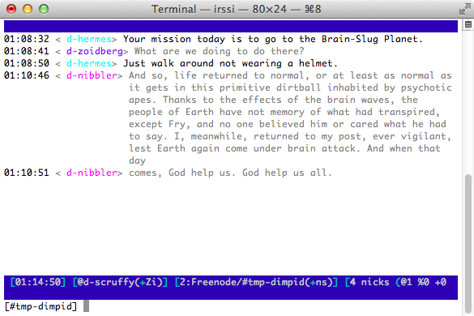

irssi-dimpid
============

An Irssi plugin that changes the public message colour of a set of pre-defined
nicks to grey. This gives less prominence to those messages, and can make it
easier to push messages from bots to the background.

## Screenshot

## Configuration

Define the nicks to dim by adding them to the space-separated `dimpid_nicks`
setting:

	/set dimpid_nicks nibbler hermes zoidberg

## License
Copyright © 2018 Teddy Wing. Licensed under the GNU GPLv3+ (see the included
COPYING file).
